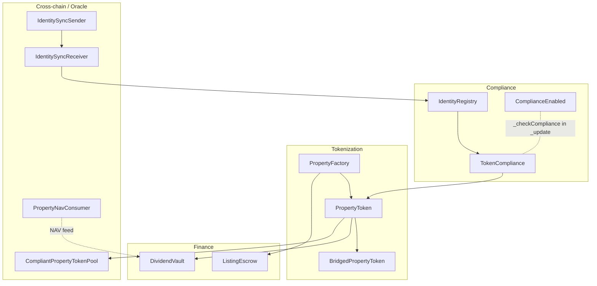

# @commertize/token-contracts

Smart contracts for Commertize — compliance-gated tokenization of commercial
real estate, with Chainlink CCIP cross-chain bridging and a Chainlink CRE oracle
for on-chain property valuation.

## Installation

```bash
pnpm add @commertize/token-contracts
```

## Quick start

Addresses, ABIs, and network metadata are resolved at import time from the
active deployment (see [Networks](#networks)):

```typescript
import { ethers } from "ethers";
import {
	CONTRACTS,
	ABIS,
	RPC_URL,
	getIdentityRegistryContract,
} from "@commertize/token-contracts";

const provider = new ethers.JsonRpcProvider(RPC_URL);

// Option A: build from the exported address map + ABI
const registry = new ethers.Contract(
	CONTRACTS.IdentityRegistry,
	ABIS.IdentityRegistry,
	provider,
);

// Option B: use a typed helper (reads the address from the active deployment)
const registry2 = getIdentityRegistryContract(provider);
```

## Architecture

The system is four layers on an EVM chain (Arc by default), tied together by the
compliance check that every token transfer routes through.



### Compliance (`src/compliance/`)

- **IdentityRegistry** — role-based registry of KYC-verified investors
  (`VERIFIED_ROLE`), with per-address country code and identity hash. Admin
  registers/removes; a separate least-privilege `SYNC_ROLE` lets a cross-chain
  receiver mirror KYC state (see [Cross-chain](#cross-chain-chainlink-ccip--cct)).
- **TokenCompliance** — points at an `IdentityRegistry` and holds an exemption
  list for infrastructure addresses (pools, escrows, vaults).
- **ComplianceEnabled** — abstract base whose `_checkCompliance(from, to)` is
  called from the token's `_update` hook. Standard transfers require **both**
  ends verified-or-exempt; mints require the receiver verified-or-exempt; burns
  are unrestricted.

### Tokenization (`src/tokenization/`)

- **PropertyToken** — ERC-20 (+ ERC-2612 Permit) representing fractional
  ownership of a property. Compliance-gated on every balance change, with a
  snapshot mechanism used for dividend distribution and a `getCCIPAdmin()` hook
  for Chainlink CCT registration.
- **BridgedPropertyToken** — destination-chain variant deployed with zero
  supply. Implements the `IBurnMintERC20` surface for CCIP pools and uses
  **mint-and-freeze**: a bridge mint always delivers (so CCIP's OffRamp sees the
  exact receiver balance delta), but the tokens are non-transferable until the
  holder is KYC-verified.
- **PropertyFactory** — deploys `PropertyToken` + `ListingEscrow` pairs and
  tracks them.

### Finance (`src/finance/`)

- **ListingEscrow** — holds property tokens and investor funds during a
  time-bound raise; finalizes to the sponsor when the target is met and
  distributes tokens, or refunds on a failed raise. `ReentrancyGuard`, `Pausable`,
  minimum-deposit and hard-cap protection, bounded investor tracking. Shares
  whose direct transfer fails at finalize park in a `pendingTokens` reserve
  that admin distribution/recovery paths cannot spend. For raises with very
  large investor counts, `finalize()`'s distribution loop can exceed block gas —
  `adminFinalize()` + chunked `adminDistributeTokens()` is the escape hatch.
- **DividendVault** — distributes property income (USDC) to holders pro-rata by
  snapshot balance, with a configurable protocol fee, batch claims, and recovery
  of unclaimed funds after a timeout. `ReentrancyGuard`, `Pausable`. Deposits
  are restricted to vetted properties (`setPropertyValid`) and to the property
  or vault owner. **Deposit only after the raise is finalized**: a dividend
  deposited while the escrow still holds unsold supply allocates that share to
  the escrow, which can never claim it (recoverable only via the one-year
  `recoverUnclaimed` sweep).

### Cross-chain (Chainlink CCIP / CCT) (`src/ccip/`)

- **CompliantPropertyTokenPool** — a CCIP `BurnMintTokenPool` that gates the
  **destination receiver** against the local `IdentityRegistry` in `lockOrBurn`,
  *before* burning. Because identity is mirrored to every chain, an
  unverified receiver can never be the target of a cross-chain transfer.
- **IdentitySyncSender** / **IdentitySyncReceiver** — broadcast KYC
  register/remove events from the home chain to every configured destination
  over CCIP, applied under `SYNC_ROLE`, so "verified anywhere ⇒ verified
  everywhere." This is what makes source-side gating sound. Every message
  carries a per-user monotonic sequence number; receivers discard anything at
  or below the last applied sequence, so CCIP's lack of cross-message ordering
  (or a manually re-executed stale message) can never resurrect a removed
  identity.

### Oracle (Chainlink CRE) (`src/oracle/`, `cre/`)

- **PropertyNavConsumer** — a Chainlink CRE report sink (built on the keystone
  `ReceiverTemplate`). A `KeystoneForwarder` calls `onReport` with a signed
  property-NAV report; the consumer accepts strictly-newer reports and exposes
  `latestNav(propertyId)` for the rest of the ecosystem to read.
- **`cre/nav-workflow/`** — the CRE workflow scaffold that produces those
  reports: cron trigger → per-node NAV/appraisal fetch → median consensus →
  on-chain write. See [`cre/README.md`](./cre/README.md). This is a scaffold —
  no production real-estate oracle is wired to a live data source yet.

## Chainlink integration

| Product | Where | What it does |
|---|---|---|
| **CCT** (Cross-Chain Token) | `BridgedPropertyToken`, `PropertyToken.getCCIPAdmin()` | Self-serve `TokenAdminRegistry` registration; `IBurnMintERC20` surface |
| **CCIP** | `CompliantPropertyTokenPool`, `IdentitySync{Sender,Receiver}` | Burn/mint bridging with source-side compliance gating + cross-chain KYC identity sync |
| **CRE** | `src/oracle/`, `cre/` | Property-NAV oracle: consensus-aggregated valuation written on-chain |

CCIP addresses (router, chain selector, RMN proxy, LINK, TokenAdminRegistry) are
configured per network in [`networks.ts`](./networks.ts).

## Deployment strategy — Arbitrum first, CRE before CCIP

Arbitrum One is the target home chain for production; Arbitrum Sepolia is its
staging mirror. Both Chainlink integrations are code-complete and tested, but
they activate in phases:

1. **Core protocol on Arbitrum** — compliance (`IdentityRegistry`,
   `TokenCompliance`), tokenization (`PropertyFactory` → `PropertyToken`), and
   finance (`ListingEscrow`, `DividendVault`) via `pnpm deploy:arbitrum-sepolia`
   / `deploy:arbitrum-one`. USDC is Circle-native on both networks.
2. **Pricing oracles via CRE (current focus).** The platform has no on-chain
   pricing oracles today; the first Chainlink integration to go live is the
   property-NAV oracle: deploy `PropertyNavConsumer` with the chain's
   `KeystoneForwarder`, then run the [`cre/nav-workflow`](./cre/README.md)
   against the Arbitrum target. Downstream pricing (dividends, escrow,
   dashboards) reads `latestNav`.
3. **CCIP / CCT cross-chain (next phase).** Identity sync
   (`IdentitySyncSender/Receiver`) and the compliant token pool are wired per
   lane with `scripts/setup-identity-sync.ts` and `scripts/ccip-register.ts`
   once a second chain is in play. Not part of the initial Arbitrum rollout.

**Topology invariant (bridged lanes).** Source-side gating is only sound if
every chain a token bridges to is mint-and-freeze. Satellite chains deploy
`BridgedPropertyToken`; if a lane will bridge *into* the home chain, the home
token must also be the role-based `BridgedPropertyToken` variant (deploy with
zero supply, then mint the initial supply under a temporary `MINTER_ROLE`) —
a plain `PropertyToken` cannot mint inbound deliveries and would strand
burned tokens whenever the receiver is unverified. `scripts/ccip-register.ts`
verifies the role/pool linkage per lane and warns when a token is not
bridge-capable.

## Security model

- **Single compliance chokepoint.** Every balance change flows through
  `PropertyToken._update → _checkCompliance`. There is no separate transfer path;
  approvals/permit set allowance only and never move balances.
- **Mint-and-freeze on bridged tokens.** Delivery can't be blocked without
  stranding burned tokens, so an unverified bridge recipient holds frozen tokens
  until KYC completes rather than being rejected.
- **Source-side bridge gating.** The pool checks the destination receiver before
  burning, backed by cross-chain identity mirroring.
- **Least privilege.** KYC mirroring runs under a dedicated `SYNC_ROLE` that can
  only register/remove identities — not grant roles or move tokens.
- **Single verification path.** `VERIFIED_ROLE` cannot be granted, revoked, or
  renounced directly; it only moves through `registerIdentity`/`removeIdentity`
  (or their `SYNC_ROLE` mirrors), so country validation and the identity map
  can never be skipped or left inconsistent.
- **Ordered identity sync.** Register/remove broadcasts embed a per-user
  monotonic sequence number enforced by every receiver; sync messages are sent
  with out-of-order execution allowed, so a stuck message can't head-of-line
  block later removals and a stale replay is a no-op. Each receiver accepts
  exactly one active source chain (sequence spaces must not mix); registry
  updates and broadcasts are separate admin calls — pair them operationally so
  chains don't drift.
- **Fault-tolerant distribution.** `ListingEscrow.finalize()` cannot be bricked
  by a single non-compliant investor: failed transfers park in `pendingTokens`
  for a later `claimTokens()` pull once the investor is verified again.
- **Closed dividend recovery.** `recoverUnclaimed` permanently closes a
  distribution, so late claimants cannot draw the recovered amount out of other
  distributions' funds. Claims themselves are compliance-gated: an unverified
  holder's share waits until they re-verify.
- **Reentrancy & pausability.** `ListingEscrow` and `DividendVault` use
  OpenZeppelin `ReentrancyGuard` and `Pausable`; all token movements use
  `SafeERC20`.
- **Snapshot-based dividends** capture holder balances at distribution time.
  Snapshots are taken by the owner or an explicitly authorized snapshotter
  (`setSnapshotter`) — the vault no longer needs to own the token.

The compliance and cross-chain contracts have undergone an internal security
review.

## Networks

Configured in [`networks.ts`](./networks.ts). The active network is selected by
the `EVM_NETWORK` env var (also `VITE_EVM_NETWORK` / `NEXT_PUBLIC_EVM_NETWORK`),
defaulting to `arc-testnet`.

| Network | Chain ID | Native | Notes |
|---|---|---|---|
| `arbitrum-one` | 42161 | ETH | Production home chain (target); CCIP-configured |
| `arbitrum-sepolia` | 421614 | ETH | Staging for the Arbitrum rollout; CCIP-configured |
| `arc-testnet` | 5042002 | USDC | Current default; CCIP-configured |
| `ethereum-sepolia` | 11155111 | ETH | CCIP destination / oracle target |
| `localhost` | 5042002 | USDC | Local Hardhat node |
| `mainnet` | 295 | — | Placeholder; confirm before production |

`EVM_NETWORK` still defaults to `arc-testnet`; the default flips to Arbitrum
with the deployment cutover, not before.

USDC is **not** deployed by this package — it is assumed to already exist on the
target chain and is read from the deployment config or `USDC_ADDRESS`.

Deployment loading precedence:

1. `DEPLOYMENT_JSON` env var (raw JSON or object) — for CI/CD.
2. Bundled `deployment.<network>.json` (underscored, e.g. `deployment.arc_testnet.json`).
3. Fallback to the `networks.ts` entry for the selected network.

## Development

```bash
pnpm install
pnpm compile           # hardhat build
pnpm test              # hardhat test
pnpm test:e2e          # full local deployment validation (needs Foundry's anvil)
pnpm deploy:localhost  # deploy to a running local node
pnpm deploy:arc-testnet
```

`pnpm test:e2e` boots an Anvil chain (`--chain-id 5042002`, matching the
`localhost` network — Hardhat's own node can't serve a custom chain id), runs
`scripts/deploy.ts` in CI mode, then `scripts/local-e2e.ts` validates the full
lifecycle on it: KYC, factory-deployed token + escrow, compliance/vault wiring,
a native raise through `finalize()`, and CRE-consumer + identity-sync
deployment. CI runs the same thing on every push/PR
([.github/workflows/e2e.yaml](./.github/workflows/e2e.yaml)).

Mainnet is deployed via a tagged release (`scripts/release.ts` / CI), not by
hand.

> Note: `test/TestnetValidation.ts` self-skips (via `process.exit(0)`) when no
> `deployment.default.json` is present, which ends the whole `hardhat test` run
> early. Run the unit suites explicitly, e.g.
> `hardhat test test/SmokeTest.ts test/CCIPCompliantPool.ts test/IdentitySync.ts test/PropertyNavOracle.ts test/PropertyTokenSnapshot.ts test/ListingEscrowRefund.ts test/ListingEscrowDistribution.ts test/DividendVault.ts`.

## Exports

**Config (resolved at import):** `NETWORK`, `CHAIN_ID`, `CURRENCY`, `RPC_URL`,
`BLOCK_EXPLORER_URL`, `CONTRACTS`, `Deployment`, `USDC_ADDRESS`.

**ABIs:** `ABIS` (`IdentityRegistry`, `Compliance`, `USDC`, `DividendVault`,
`PropertyFactory`, `PropertyToken`, `ListingEscrow`, `IdentitySyncSender`,
`PropertyNavConsumer`), plus `ListingEscrowAbi` and `ErrorStringAbi`.

**Contract helpers.** Singletons read their address from the active deployment
and take just a runner: `getIdentityRegistryContract`, `getComplianceContract`,
`getUSDCContract`, `getDividendVaultContract`, `getPropertyFactoryContract`.
Per-listing / per-chain contracts take an explicit address:
`getPropertyTokenContract(address, runner)` (alias `getTokenContract`),
`getEscrowContract(address, runner)`,
`getIdentitySyncSenderContract(address, runner)`,
`getPropertyNavConsumerContract(address, runner)`.

Full artifacts (ABI + bytecode) for backend deployment are exported as
`IdentityRegistryArtifact`, `TokenComplianceArtifact`, `IdentitySyncSenderArtifact`,
and `PropertyNavConsumerArtifact`.

## License

MIT, except `src/ccip/CompliantPropertyTokenPool.sol` (BUSL-1.1). Vendored
Chainlink keystone interfaces under `src/oracle/keystone/` are MIT.
