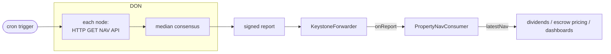

# Property NAV Oracle — Chainlink CRE template

A [Chainlink CRE](https://docs.chain.link/cre) workflow that pushes property
net-asset-value (NAV) on-chain for the Commertize PropertyToken ecosystem.



A cron trigger fires on a schedule; every DON node fetches the NAV API
independently; the nodes agree on the **median** NAV (Byzantine-robust); the
aggregated value is ABI-encoded, signed, and delivered to a `PropertyNavConsumer`
on each configured chain via the `KeystoneForwarder`. One run fans out to every
chain in the `evms` config array.

## Layout

```
cre/
├── project.yaml          # per-target RPCs, don-family, workflow owner
├── secrets.yaml          # secret id -> env var
├── .env.example          # copy to .env (gitignored)
└── nav-workflow/
    ├── main.ts           # entrypoint (Runner)
    ├── workflow.ts       # cron handler, HTTP fetch, consensus, EVM write
    ├── config.staging.json / config.production.json
    ├── workflow.yaml     # staging/production artifact settings
    ├── package.json      # Bun deps: @chainlink/cre-sdk, viem, zod
    └── contracts/generated/   # CRE-generated Viem bindings (not checked in)
```

The consumer contract lives with the rest of the Solidity in
`src/oracle/PropertyNavConsumer.sol` (plus vendored Chainlink keystone
interfaces under `src/oracle/keystone/`) so it compiles, tests, and exports its
ABI through the package like every other contract.

## Report shape

The workflow's `encodeAbiParameters` and the consumer's `_processReport` must
stay in lockstep:

```
(bytes32 propertyId, uint256 nav, uint32 timestamp)
```

- `nav` is scaled to 18 decimals (`parseUnits(nav, 18)`).
- `timestamp` is the report's as-of time; the consumer accepts **strictly
  newer** reports only and silently discards stale/replayed ones (a revert
  would be retried by the forwarder forever — the receiver is responsible for
  dropping stale reports).

## Prerequisites

- **CRE CLI** (verified `v1.24.0`, 2026-07-14):
  ```bash
  curl -sSL https://app.chain.link/cre/install.sh | bash   # -> $HOME/.cre
  cre version
  ```
- **Bun** runtime (workflows compile to WASM; not npm/node).
- Deploying is **Early Access** — request via `cre account access` or
  https://app.chain.link/cre/request-access. **Simulation needs no access** but
  makes real API + RPC calls.

## Setup

```bash
cp cre/.env.example cre/.env      # fill CRE_ETH_PRIVATE_KEY, RPC URLs, NAV_API_KEY
cd cre/nav-workflow && bun install
```

`project.yaml` interpolates these RPC vars from `cre/.env`:
`ARBITRUM_SEPOLIA_RPC_URL`, `ETH_SEPOLIA_RPC_URL`, `BASE_SEPOLIA_RPC_URL`
(staging) and `ARBITRUM_ONE_RPC_URL` (production).

1. **Deploy the consumer** (one per target chain) with that chain's
   `KeystoneForwarder` (Forwarder Directory values, verified 2026-07-21 —
   re-confirm with `cre workflow supported-chains` before deploying):

   | Chain | CRE chain-name | Forwarder |
   |---|---|---|
   | Arbitrum Sepolia | `ethereum-testnet-sepolia-arbitrum-1` | `0x76c9cf548b4179F8901cda1f8623568b58215E62` |
   | Ethereum Sepolia | `ethereum-testnet-sepolia` | `0xF8344CFd5c43616a4366C34E3EEE75af79a74482` |
   | Base Sepolia | `ethereum-testnet-sepolia-base-1` | `0xF8344CFd5c43616a4366C34E3EEE75af79a74482` |
   | Arbitrum One | `ethereum-mainnet-arbitrum-1` | `0xF8344CFd5c43616a4366C34E3EEE75af79a74482` † |

   † The directory lists the same forwarder for Arbitrum One as for the two
   Sepolias, which is unusual — verify on-chain before any mainnet deploy.

   Put the deployed addresses in `config.*.json` (`consumerAddress`) and set
   `propertyId`.
2. **Generate contract bindings** into `nav-workflow/contracts/generated/` from
   the compiled `PropertyNavConsumer` ABI (`pnpm build` in the package emits it
   under `artifacts/`), using the CRE CLI's binding generator. The generated
   `PropertyNavConsumer.ts` is what `workflow.ts` imports.

## Simulate & deploy

```bash
# from cre/  (pass the workflow directory)
cre workflow simulate nav-workflow --target staging-settings              # dry run
cre workflow simulate nav-workflow --target staging-settings --broadcast  # real testnet write
cre workflow simulate nav-workflow --target staging-settings --broadcast --non-interactive --trigger-index 0  # CI

# deploy (Early Access)
cre login
cre workflow deploy   nav-workflow --target production-settings
cre workflow activate nav-workflow --target production-settings
# lifecycle: pause | deploy (again = update) | delete | get | list
```

## Production hardening

After deploy, pin the workflow identity on each consumer so a different workflow
sharing the same forwarder cannot write NAVs:

```solidity
consumer.setExpectedAuthor(workflowOwner);   // project.yaml account address
consumer.setExpectedWorkflowId(workflowId);  // from `cre workflow get`
```

## Service quotas (confirm against docs before prod)

exec timeout 5 min · mem 100 MB · report ≤ 100 KB · WASM ≤ 20 MB compressed ·
config ≤ 50 KB · cron min 30 s · per-exec 5 HTTP / 15 EVM reads / 5 secrets ·
5 concurrent execs per owner. See https://docs.chain.link/cre/service-quotas.

## Version-sensitive / unverified

- `@chainlink/cre-sdk ^1.16.0`, `viem 2.34.0`, `zod 3.25.76`, CRE CLI `v1.24.0`
  (verified 2026-07-14). The SDK is pre-1.0-stable in spirit — pin and re-verify
  the `cre.capabilities.*` / `writeReport` / `ConsensusAggregationByFields` API
  when bumping.
- **LINK/billing model for workflow execution is not documented** — confirm cost
  with Chainlink before production.
- **Arbitrum One and Arbitrum Sepolia are CRE-supported targets** (verified
  2026-07-21 against the CRE supported-networks page; CLI/SDK v1.0+ required).
  Staging fans out to Arbitrum Sepolia + Ethereum Sepolia + Base Sepolia;
  production targets Arbitrum One, the platform's home chain
  (Arbitrum-first rollout — see the package README's deployment strategy).
- **Arc testnet is not in any CRE supported-chain list** (as of 2026-07-14).
  If NAV must reach Arc, bridge/relay the value from a supported chain, or
  re-check CRE Arc support before relying on it.
