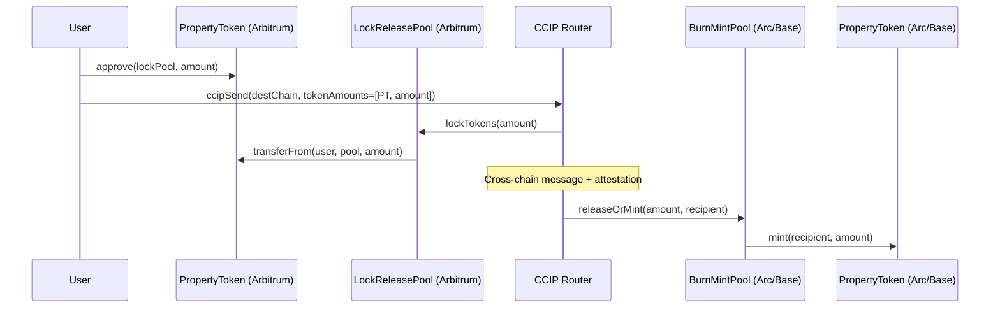

# CCIP Cross-Chain Bridge Design

## Status: Design Phase

PropertyToken cross-chain bridging via Chainlink CCIP. Tokens are canonical on Arbitrum (home chain) and bridged to Arc and Base via lock-and-mint pools.

## Available Infrastructure

### Testnet

| Chain | Router | Chain Selector | LINK |
|---|---|---|---|
| Arbitrum Sepolia | `0x2a9C5afB0d0e4BAb2BCdaE109EC4b0c4Be15a165` | `3478487238524512106` | `0xb1D4538B4571d411F07960EF2838Ce337FE1E80E` |
| Arc Testnet | `0xdE4E7FED43FAC37EB21aA0643d9852f75332eab8` | `3034092155422581607` | `0x3F1f176e347235858DD6Db905DDBA09Eaf25478a` |
| Base Sepolia | `0xD3b06cEbF099CE7DA4AcCf578aaebFDBd6e88a93` | `10344971235874465080` | `0xE4aB69C077896252FAFBD49EFD26B5D171A32410` |

### Mainnet

| Chain | Router | Chain Selector | LINK |
|---|---|---|---|
| Arbitrum | `0x141fa059441E0ca23ce184B6A78bafD2A517DdE8` | `4949039107694359620` | `0xf97f4df75117a78c1A5a0DBb814Af92458539FB4` |
| Base | `0x881e3A65B4d4a04dD529061dd0071cf975F58bCD` | `15971525489660198786` | `0x88Fb150BDc53A65fe94Dea0c9BA0a6dAf8C6e196` |

## Architecture: Lock-and-Release via CCIP Token Pools

## Home Chain (Arbitrum): LockReleaseTokenPool

Locks PropertyTokens on Arbitrum when bridging out. Releases when bridging back.

**Requirements:**
- Must be `exempt` on PropertyToken (`setExempt(poolAddress, true)`)
- Registered in Token Admin Registry
- Pool admin = PropertyToken owner

**Per-property:** Each PropertyToken gets its own LockReleaseTokenPool.

## Destination Chains (Arc, Base): BurnMintTokenPool

Mints mirrored PropertyTokens on receive. Burns on send-back.

**Requirements:**
- Deploy compliance stack on destination (IdentityRegistry, CredentialRegistry, CredentialCheckPolicy)
- Deploy `BurnMintPropertyToken` — PropertyToken variant with pool-restricted `mint()`/`burn()`
- Pool set as `exempt` on destination PropertyToken
- Registered in destination Token Admin Registry

**CCID portability:** Same `keccak256("commertize", privyId)` on all chains. Backend mirrors identity registrations.

## Compliance

| Scenario | Handling |
|---|---|
| Lock on Arbitrum (user → pool) | Pool is exempt — no compliance check |
| Mint on destination (pool → user) | Pool is exempt — but user must be registered on destination IdentityRegistry |
| Transfer on destination | Full compliance check on destination's stack |
| Burn on destination (user → pool) | Pool is exempt |
| Release on Arbitrum (pool → user) | Pool is exempt — user already registered on Arbitrum |

**Critical:** User must have registered identity + valid KYC on **every chain** where they hold tokens. Backend syncs registrations.

## Rate Limits

CCIP token pools enforce configurable rate limits:
- `capacity`: max tokens bridgeable in a burst
- `rate`: tokens per second refill
- Set conservatively at launch, increase with audit confidence

## Fee Structure

CCIP fees paid in LINK or native token. Typical:
- Token transfer: ~0.5-2 LINK
- Backend can sponsor fees (gasless bridging) or user pays directly

## Implementation Steps

### Phase 1: Arbitrum → Arc Bridge
1. Implement `BurnMintPropertyToken` extending PropertyToken
2. Deploy compliance stack on Arc testnet
3. Deploy `LockReleaseTokenPool` on Arbitrum Sepolia
4. Deploy `BurnMintTokenPool` + `BurnMintPropertyToken` on Arc testnet
5. Register pools in Token Admin Registry on both chains
6. Test end-to-end: lock on Arbitrum, mint on Arc, transfer on Arc, burn on Arc, release on Arbitrum

### Phase 2: Arbitrum → Base Bridge
Repeat Phase 1 for Base Sepolia.

### Phase 3: Dashboard + Backend
1. Bridge UI — source/dest chain selector, amount, fee display
2. CCIP Explorer tracking for bridge status
3. Multi-chain identity sync in backend
4. Cross-chain holdings aggregation

## References

- [CCIP Architecture](https://docs.chain.link/ccip/architecture)
- [CCIP Token Transfer Tutorial](https://docs.chain.link/ccip/tutorials/cross-chain-tokens)
- [Token Admin Registry](https://docs.chain.link/ccip/concepts/cross-chain-tokens)
- [CCIP Testnet Directory](https://docs.chain.link/ccip/directory/testnet)
