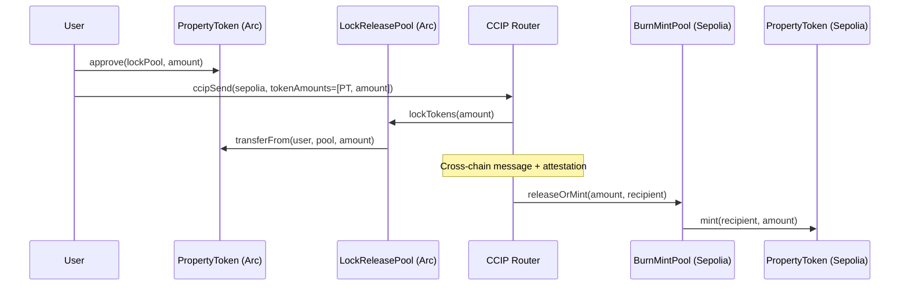

# CCIP Cross-Chain Bridge Design

## Status: Design Phase

PropertyToken cross-chain bridging via Chainlink CCIP. CCIP is live on Arc testnet with an Arc ↔ Ethereum Sepolia lane. This document covers the architecture for bridging compliance-gated PropertyTokens across chains.

## Available Infrastructure (Arc Testnet)

| Contract | Address |
|---|---|
| CCIP Router | `0xdE4E7FED43FAC37EB21aA0643d9852f75332eab8` |
| LINK Token | `0x3F1f176e347235858DD6Db905DDBA09Eaf25478a` |
| WUSDC | `0xbf4B839A7939a52acbF8fC52D5Bd5BFE69a064EA` |
| Token Admin Registry | `0xd3e461C55676B10634a5F81b747c324B85686Dd1` |
| Arc Chain Selector | `3034092155422581607` |
| Sepolia Chain Selector | `16015286601757825753` |

## Architecture: Lock-and-Release via CCIP Token Pools

## Source Chain (Arc): LockReleaseTokenPool

The pool locks PropertyTokens on Arc when bridging out and releases them when bridging back.

**Key requirements:**
- Must be set as **exempt** on PropertyToken (compliance bypass for pool mechanics)
- Must be registered in the Token Admin Registry
- Pool admin = PropertyToken owner (for operational control)

**Registration flow:**
1. Deploy `LockReleaseTokenPool` pointing to the PropertyToken
2. Call `PropertyToken.setExempt(poolAddress, true)`
3. Register pool in `TokenAdminRegistry.setPool(propertyToken, poolAddress)`
4. Configure rate limits per Chainlink recommendations

## Destination Chain (Sepolia): Mirrored Deployment

A full compliance stack must be deployed on Sepolia:

1. **IdentityRegistry** — fresh instance, same REGISTRAR_ROLE
2. **CredentialRegistry** — fresh instance, same ISSUER_ROLE
3. **CredentialCheckPolicy** — requires KYC + AML
4. **PropertyToken** — identical name/symbol, `BurnMintERC20` capability
5. **BurnMintTokenPool** — mints on receive, burns on send-back

**CCID portability:** The CCID (`bytes32`) is deterministic (`keccak256("commertize", privyId)`) and chain-agnostic. The same CCID can be registered on both chains. The backend must mirror identity registrations to the destination chain.

## Compliance Challenge

PropertyToken transfers enforce compliance via `CredentialCheckPolicy.check()`. Cross-chain bridging adds complexity:

| Scenario | Handling |
|---|---|
| Lock on Arc (user → pool) | Pool is exempt — no compliance check |
| Mint on Sepolia (pool → user) | Pool is exempt on Sepolia — but user must be registered on Sepolia's IdentityRegistry |
| Transfer on Sepolia | Full compliance check on Sepolia's stack |
| Burn on Sepolia (user → pool) | Pool is exempt |
| Release on Arc (pool → user) | Pool is exempt — user already registered on Arc |

**Critical:** A user must have a registered identity + valid KYC on **both** chains to hold and transfer tokens. The backend must sync registrations across chains.

## Implementation Steps

### Phase 1: Contracts
1. Implement `BurnMintPropertyToken` extending PropertyToken with `burn(amount)` and `mint(to, amount)` restricted to the pool
2. Deploy compliance stack on Sepolia (IdentityRegistry, CredentialRegistry, CredentialCheckPolicy)
3. Deploy `BurnMintPropertyToken` on Sepolia
4. Deploy `LockReleaseTokenPool` on Arc
5. Deploy `BurnMintTokenPool` on Sepolia
6. Register both pools in respective Token Admin Registries

### Phase 2: Backend
1. Add Sepolia provider + signer to `config/web3.ts`
2. Extend `TokenService.registerIdentity()` to mirror registrations to Sepolia
3. Add `TokenService.bridgeTokens()` — builds CCIP message, estimates fee, sends via router
4. Add bridge status tracking (poll CCIP Explorer API for message delivery)

### Phase 3: Dashboard
1. Bridge UI — source/destination chain selector, amount input, fee display
2. Bridge status tracker — pending/inflight/delivered states
3. Cross-chain holdings aggregation — sum balances across chains

## Fee Structure

CCIP fees are paid in LINK or native token (USDC on Arc). Typical testnet fees:
- Data-only message: ~0.1-0.5 LINK
- Token transfer: ~0.5-2 LINK (includes attestation + execution)

The backend can sponsor fees (gasless bridging) or the user can pay directly.

## Rate Limits

CCIP token pools enforce configurable rate limits:
- `capacity`: maximum tokens that can be bridged in a burst
- `rate`: tokens per second refill rate
- Set conservatively at launch, increase with audit confidence

## References

- [CCIP Architecture](https://docs.chain.link/ccip/architecture)
- [CCIP Token Transfer Tutorial](https://docs.chain.link/ccip/tutorials/cross-chain-tokens)
- [Token Admin Registry](https://docs.chain.link/ccip/concepts/cross-chain-tokens)
- [Arc Testnet CCIP Directory](https://docs.chain.link/ccip/directory/testnet/chain/arc-testnet)
