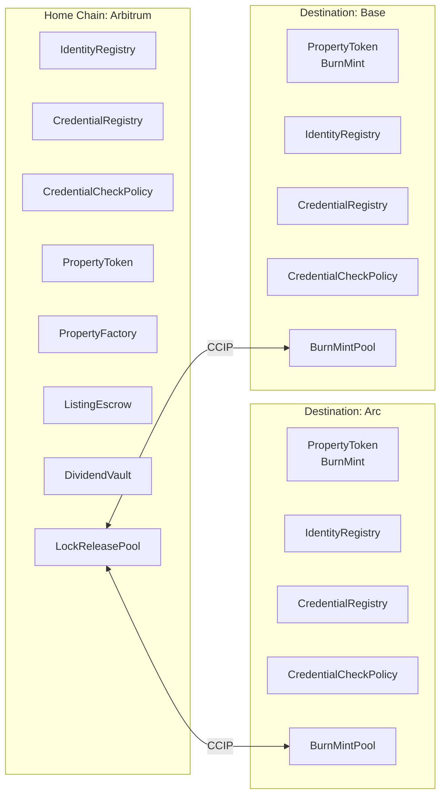
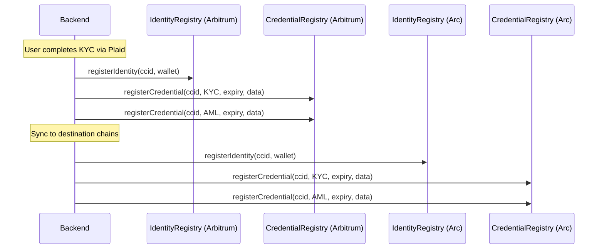

# Chainlink Integration — Technical Design

## Network Topology

Arbitrum is the home chain for all core contract deployments. Arc and Base are destination chains where PropertyTokens can be bridged via Chainlink CCIP.



### Chain Roles

| Chain | Role | Deploy | CCIP |
|---|---|---|---|
| **Arbitrum** (mainnet: 42161, testnet: 421614) | Home — canonical PropertyTokens, compliance, escrow, dividends | Full stack | LockReleasePool per property |
| **Arc** (testnet: 5042002) | Destination — USDC-native gas, Circle ecosystem | Compliance + BurnMintPropertyToken | BurnMintPool per property |
| **Base** (mainnet: 8453, testnet: 84532) | Destination — high liquidity, Coinbase ecosystem | Compliance + BurnMintPropertyToken | BurnMintPool per property |

### Why Arbitrum as Home

- Full Chainlink infrastructure: CCIP, Data Feeds, Automation, Data Streams
- Active CCIP lanes to both Arc and Base
- EVM-compatible with low gas costs
- ACE planned (already live on Base)
- Institutional adoption in RWA/DeFi

### Why Arc and Base as Destinations

**Arc:** Circle's L1 with USDC-native gas. Aligns with USDC payment flows. CCIP lane to Arbitrum confirmed. Strategic for stablecoin-centric RWA.

**Base:** Largest Coinbase-ecosystem chain. Full Chainlink stack including ACE. High DeFi liquidity for secondary markets. CCIP lane to Arbitrum confirmed.

---

## Chainlink Products Used

### 1. CCIP — Cross-Chain Token Bridging

**Purpose:** Move PropertyTokens between Arbitrum (home), Arc, and Base. Replaces the previous LayerZero integration.

**Pattern:** Lock-and-mint via CCIP Token Pools.

```
Arbitrum → Arc:    LockReleasePool locks tokens → CCIP → BurnMintPool mints on Arc
Arc → Arbitrum:    BurnMintPool burns tokens → CCIP → LockReleasePool releases on Arbitrum
```

**Contracts per property (per destination chain):**

| Chain | Contract | Role |
|---|---|---|
| Arbitrum | `LockReleaseTokenPool` | Locks PropertyTokens when bridging out, releases when bridging back |
| Arc | `BurnMintTokenPool` | Mints mirrored PropertyTokens on receive, burns on send-back |
| Base | `BurnMintTokenPool` | Same as Arc |

**Self-serve registration:** Token admins register their PropertyToken + pool pair in the on-chain `TokenAdminRegistry` without Chainlink intervention.

**Compliance integration:** All pools are set as `exempt` on PropertyToken (`setExempt(poolAddress, true)`). This bypasses credential checks for pool mechanics while preserving compliance for user-to-user transfers.

**CCIP addresses (testnet):**

| Chain | Router | Chain Selector | LINK |
|---|---|---|---|
| Arbitrum Sepolia | `0x2a9C5afB0d0e4BAb2BCdaE109EC4b0c4Be15a165` | `3478487238524512106` | `0xb1D4538B4571d411F07960EF2838Ce337FE1E80E` |
| Arc Testnet | `0xdE4E7FED43FAC37EB21aA0643d9852f75332eab8` | `3034092155422581607` | `0x3F1f176e347235858DD6Db905DDBA09Eaf25478a` |
| Base Sepolia | `0xD3b06cEbF099CE7DA4AcCf578aaebFDBd6e88a93` | `10344971235874465080` | `0xE4aB69C077896252FAFBD49EFD26B5D171A32410` |

### 2. Data Feeds — Property Valuation & Gas Estimation

**Purpose:** On-chain price reference for ETH/USD (gas cost display), potential property NAV feeds.

**Availability:**

| Chain | Status | Use Case |
|---|---|---|
| Arbitrum | Live (extensive feed catalog) | ETH/USD for gas display, USDC/USD peg monitoring |
| Base | Live | Same |
| Arc | Data Streams only (pull-based) | Crypto price feeds via pull model |

**Integration point:** Dashboard gas cost estimation reads the ETH/USD feed on Arbitrum. No contract-level dependency — read via `AggregatorV3Interface` in the backend or dashboard.

### 3. Automation — Credential Expiry & Escrow Deadlines

**Purpose:** Decentralized cron for time-sensitive compliance operations.

**Availability:** Live on Arbitrum and Base. Not available on Arc.

**Use cases:**

| Trigger | Action | Chain |
|---|---|---|
| KYC credential nearing expiry | Notify backend to request re-verification | Arbitrum |
| Escrow deadline passed + target not met | Auto-trigger `refund()` on ListingEscrow | Arbitrum |
| Scheduled dividend distribution | Trigger `DividendVault.depositDividend()` | Arbitrum |

**Integration:** Register Chainlink Automation upkeeps on Arbitrum. Custom logic upkeeps check credential expiry timestamps and escrow deadlines via `checkUpkeep()` / `performUpkeep()`.

### 4. Data Streams — Real-Time Pricing (Future)

**Purpose:** Low-latency, pull-based price feeds for real-time property token pricing on secondary markets.

**Availability:** Arbitrum, Base, and Arc testnet.

**Use case:** If PropertyTokens trade on DEXs, Data Streams provide sub-second pricing for NAV calculations, liquidation triggers, and oracle-gated DeFi composability.

**Phase:** Future. Requires secondary market infrastructure first.

### 5. ACE — Native Compliance (Future)

**Purpose:** Replace our custom compliance stack with Chainlink's audited, standards-based compliance engine.

**Availability:** Live on Base. Planned for Arbitrum.

**Current status:** We implemented ACE's identity/credential patterns from scratch (CCID IdentityRegistry, CredentialRegistry, CredentialCheckPolicy). If ACE becomes available on Arbitrum, migration is a deployment-level swap — our interfaces mirror ACE's.

**What migration gains:** Audited contracts, GLEIF vLEI credential integration, cross-chain credential verification via CCIP, Chainlink-managed policy engine.

**Blocker:** ACE availability on Arbitrum mainnet. BUSL-1.1 license requires Chainlink's production-use grant.

---

## Cross-Chain Compliance Architecture

### Identity Sync

Investor identity (CCID) and credentials must be registered on every chain where they hold tokens. The CCID is deterministic (`keccak256("commertize", privyId)`), so the same value is used on all chains.



**Sync strategy:** Backend mirrors identity + credential registrations to all active destination chains. Credential renewal and revocation are also synced.

**Future optimization:** When ACE is available, CCIP can carry credential proofs cross-chain, eliminating the need for per-chain credential mirroring.

### Transfer Compliance per Chain

| Operation | Compliance Check |
|---|---|
| Transfer on Arbitrum | Inline exempt → freeze → CredentialCheckPolicy (home chain stack) |
| Bridge: Arbitrum → Arc | Pool exempt on Arbitrum (lock). Pool exempt on Arc (mint). User must be registered on Arc. |
| Transfer on Arc | Inline exempt → freeze → CredentialCheckPolicy (Arc's compliance stack) |
| Bridge: Arc → Arbitrum | Pool exempt on Arc (burn). Pool exempt on Arbitrum (release). |

---

## Deployment Topology

### Home Chain (Arbitrum) — Full Stack

```
1.  IdentityRegistry
2.  CredentialRegistry (requires #1)
3.  CredentialCheckPolicy (requires #1 + #2)
4.  PropertyFactory
5.  DividendVault
    ─── per property ───
6.  PropertyToken (via PropertyFactory, with CredentialCheckPolicy)
7.  ListingEscrow (via PropertyFactory, with IdentityRegistry + CredentialRegistry)
8.  LockReleaseTokenPool (per destination chain)
```

### Destination Chain (Arc / Base) — Compliance + Mirrored Token

```
1.  IdentityRegistry
2.  CredentialRegistry (requires #1)
3.  CredentialCheckPolicy (requires #1 + #2)
    ─── per property ───
4.  BurnMintPropertyToken (PropertyToken with burn/mint restricted to pool)
5.  BurnMintTokenPool
```

### Contract Summary

| Contract | Arbitrum | Arc | Base | Notes |
|---|---|---|---|---|
| IdentityRegistry | 1 | 1 | 1 | Same CCID format, backend-synced |
| CredentialRegistry | 1 | 1 | 1 | Same credential types, backend-synced |
| CredentialCheckPolicy | 1 | 1 | 1 | Same KYC+AML requirements |
| PropertyToken | N (per property) | N (mirrored) | N (mirrored) | Home: canonical. Dest: BurnMint variant |
| PropertyFactory | 1 | 0 | 0 | Only on home chain |
| ListingEscrow | N (per property) | 0 | 0 | Only on home chain |
| DividendVault | 1 | 0 | 0 | Only on home chain |
| LockReleaseTokenPool | N (per property) | 0 | 0 | One per property on home chain |
| BurnMintTokenPool | 0 | N (per property) | N (per property) | One per property per dest chain |

---

## Implementation Phases

### Phase 1: Arbitrum Home Chain (Current)

Deploy the full compliance + tokenization stack on Arbitrum Sepolia:
- IdentityRegistry, CredentialRegistry, CredentialCheckPolicy
- PropertyFactory, PropertyToken, ListingEscrow, DividendVault
- Validate with existing SmokeTest suite (16 tests)
- Update backend `web3.ts` to point to Arbitrum Sepolia

### Phase 2: CCIP Bridge to Arc

1. Implement `BurnMintPropertyToken` extending PropertyToken with pool-restricted `burn()`/`mint()`
2. Deploy compliance stack on Arc testnet (IdentityRegistry, CredentialRegistry, CredentialCheckPolicy)
3. Deploy `LockReleaseTokenPool` on Arbitrum Sepolia
4. Deploy `BurnMintTokenPool` + `BurnMintPropertyToken` on Arc testnet
5. Register pools in CCIP Token Admin Registry on both chains
6. Backend: add multi-chain identity sync, bridge transaction builder
7. Dashboard: bridge UI with chain selector, fee estimation, CCIP Explorer tracking

### Phase 3: CCIP Bridge to Base

Repeat Phase 2 pattern for Base Sepolia:
1. Deploy compliance stack on Base Sepolia
2. Deploy `BurnMintTokenPool` + `BurnMintPropertyToken` on Base Sepolia
3. Add `LockReleaseTokenPool` lane on Arbitrum Sepolia for Base direction
4. Register pools in CCIP Token Admin Registry
5. Backend: extend identity sync to include Base
6. Dashboard: add Base to chain selector

### Phase 4: Chainlink Automation

Register Automation upkeeps on Arbitrum:
1. Credential expiry checker — scans CredentialRegistry for approaching expiry
2. Escrow deadline enforcer — triggers refund when deadline passes
3. Dividend scheduler — quarterly `depositDividend()` trigger

### Phase 5: Production

1. Deploy full stack on Arbitrum mainnet
2. Deploy destination stacks on Arc mainnet (when available) and Base mainnet
3. Configure mainnet CCIP lanes and token pools
4. Mainnet Automation upkeeps

---

## What We Build vs What Chainlink Provides

| Concern | Our Code | Chainlink |
|---|---|---|
| Identity (CCID) | `IdentityRegistry.sol` | ACE IdentityRegistry (future swap) |
| Credentials | `CredentialRegistry.sol` | ACE CredentialRegistry (future swap) |
| Transfer compliance | `CredentialCheckPolicy.sol` + inline checks on PropertyToken | ACE PolicyEngine (future swap) |
| Cross-chain messaging | — | CCIP Router + Token Pools |
| Token pool contracts | Deploy + configure | `LockReleaseTokenPool`, `BurnMintTokenPool` (Chainlink contracts) |
| Pool registration | Call `TokenAdminRegistry` | Self-serve on-chain registry |
| Price feeds | Read via backend | `AggregatorV3Interface` on Arbitrum/Base |
| Cron/automation | — | Automation upkeeps on Arbitrum |
| Real-time pricing | — | Data Streams (future) |

---

## Risk Assessment

| Risk | Severity | Mitigation |
|---|---|---|
| CCIP lane unavailability (Arc testnet) | Medium | Arc ↔ Sepolia lane confirmed. Verify Arbitrum ↔ Arc lane directly or route via Ethereum Sepolia. |
| Identity sync lag between chains | Medium | Backend syncs on KYC approval. Async — user cannot bridge until destination identity is confirmed. |
| BurnMintPropertyToken supply divergence | High | CCIP Token Pools handle supply accounting. Rate limits prevent runaway minting. Audit pool math. |
| Credential expiry on destination chain | Medium | Backend syncs renewals. Automation monitors expiry on home chain. Destination credentials mirror home. |
| ACE license (BUSL-1.1) | Low | Not importing ACE code. Our contracts are MIT-licensed re-implementations of ACE patterns. |
| Gas cost for multi-chain compliance | Low | Compliance checks are 1 external call + inline SLOADs (~10,900 gas). Acceptable for security tokens. |

---

## References

- [CCIP Architecture](https://docs.chain.link/ccip/architecture)
- [CCIP Self-Serve Token Registration](https://docs.chain.link/ccip/concepts/cross-chain-tokens/evm/registration-administration)
- [Chainlink ACE](https://github.com/smartcontractkit/chainlink-ace)
- [Arbitrum CCIP Directory](https://docs.chain.link/ccip/directory/mainnet/chain/ethereum-mainnet-arbitrum-1)
- [Base CCIP Directory](https://docs.chain.link/ccip/directory/mainnet/chain/ethereum-mainnet-base-1)
- [Chainlink Automation](https://docs.chain.link/chainlink-automation)
- [Data Streams](https://docs.chain.link/data-streams)
- `docs/tdd/ace_migration.md` — original ACE migration spec (historical reference)
